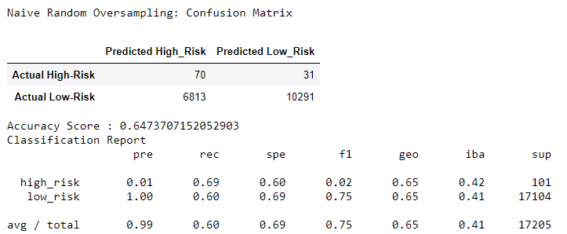
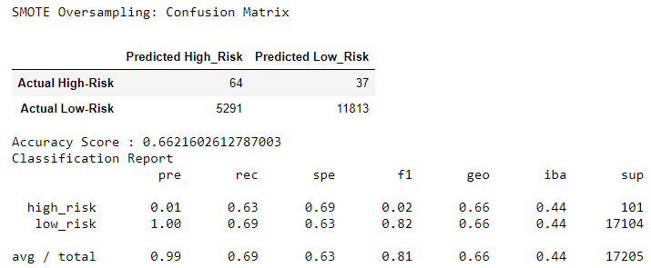
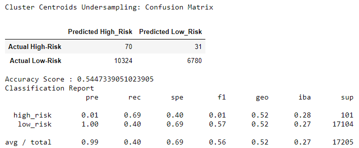
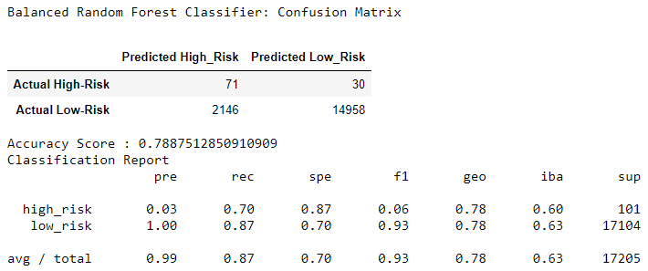
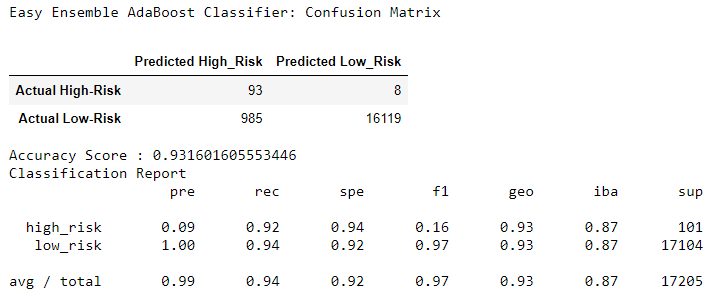

# Credit_Risk_Analysis

## Overview of the analysis
 Fast Lending, a peer-to-peer lending services company wants to use machine learning to predict credit risk. Credit risk is an inherently unbalanced classification problem, as good loans easily outnumber risky loans. Machine learning techniques such as oversampling, undersampling and boosting will be used to build and evaluate several machine learning algorithms to predict credit risk. Once designed and implemented, the performances of these algorithms will be evaluated to see how well the models predict data. 

The technical analysis deliverables required to complete the Credit Risk analysis include:  

1. Use Resampling Models to Predict Credit Risk.
2. Use the SMOTEENN Algorithm to Predict Credit Risk.
3. Use Ensemble Classifiers to Predict Credit Risk

## Resources
- Data Source: This analysis was performed using the ***LoanStats_2019Q1.csv*** dataset.  
- Software: Python 3.7, Visual Studio Code 1.50.0, Anaconda 4.8.5, Jupyter Notebook 6.1.4 and Pandas

## Results: 

### The balanced accuracy score and the precision and recall scores of all six machine learning models are shown: 

##### a.) Random Oversampler:

    

##### b.) SMOTE Oversampler:

    

##### c.) ClusterCentroids Undersampler:

    

##### d.) SMOTEENN combinationsampler:

    

#### e.) Balanced Random Forest Classifier:
    

#### f.) Easy Ensemble AdaBoost Classifier:

    

## Summary:
- The Easy Ensemble AdaBoost Classifier had the highest accuracy score and provided the highest sensitivity of all the six models. However, the precision and the F1 scores were low for all models.  In General, utilizing EasyEnsembleClassifier will provide the best ability to detect high-risk loans with recall score of 92%.

